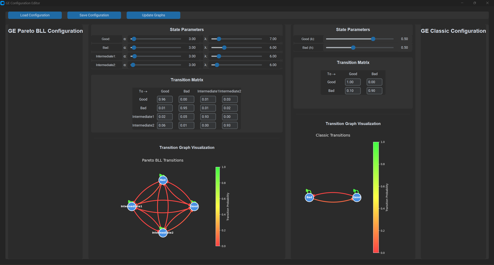
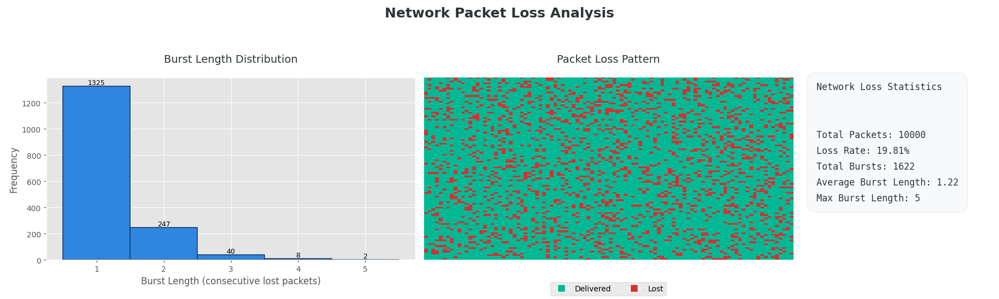

# PyGE - Gilbert-Elliott Network Packet Loss Emulator

[](https://www.python.org/downloads/)
[](https://opensource.org/licenses/MIT)

A Python implementation of Gilbert-Elliott packet loss models with advanced network emulation capabilities.

## Key Features

### Gilbert-Elliott Models
- **Classic 2-State GE Model** - Basic Markov chain model with Good/Bad states
- **3-Parameter Extended GE** - Enhanced model with additional transition parameters
- **4-State HMM Model** - Advanced Hidden Markov Model with Pareto-distributed Burst Length Loss (BLL)

### Advanced Packet Loss Modeling
- **Pareto BLL Model** - Implements heavy-tailed Pareto distribution for burst loss characterization
- **Cross-Layer Emulation** - Considers both physical layer (SNR) and MAC layer (channel occupation) parameters
- **Real-time Visualization** - Integrated matplotlib visualizations for loss patterns and burst statistics

### Network Emulation
- **Programmatic Packet Loss Injection** - UDP/TCP packet manipulation using Scapy
- **GUI Configuration** - Real-time parameter adjustment through dedicated interface
- **Logging & Analysis** - LZ4-compressed packet logs with statistical analysis tools

## Installation

**System Requirements:**
- Linux kernel 4.4+ (for raw socket access)
- libpcap-dev (Scapy dependency)
- Tested with Python 3.8-3.10

## Usage

### Launch GUI Configuration:

```bash
python src/pyge/configurationUI.py
```

### GUI Configuration Interface:




### Launch Network Emulator:

```bash
python src/pyge/network_emulator.py --input-port 5000 --output-port 5001 --protocol udp --model GE_Pareto_BLL --config config.json --log packet_logs.bin
```

### Programmatic Emulator Control:
```python
from pyge.emulators.packet_loss_emulator import PacketLossEmulator


emulator = PacketLossEmulator(
    input_port=6000,
    output_port=6001,
    output_ip='127.0.0.1',  # Destination IP address
    model_name='GE_Pareto_BLL',
    params_path='config.json',
    log_packets=True,  # Enable packet logging
    log_path='packet_log.bin'  # Path to save packet logs
)
emulator.start()
```




### Configuration File Example (config.json):
```json
{
    "GE_Pareto_BLL": {
        "Good": {
            "transitions": {
                "Good": 0.75,
                "Bad": 0.05,
                "Intermediate1": 0.1,
                "Intermediate2": 0.1
            },
            "distribution": "pareto",
            "params": {
                "alpha": 3.0,
                "lambda": 6.0
            }
        },
        "Bad": {
            "transitions": {
                "Good": 0.05,
                "Bad": 0.75,
                "Intermediate1": 0.1,
                "Intermediate2": 0.1
            },
            "distribution": "pareto", 
            "params": {
                "alpha": 3.0,
                "lambda": 6.0
            }
        },
        "Intermediate1": {
            "transitions": {
                "Good": 0.1,
                "Bad": 0.1,
                "Intermediate1": 0.7,
                "Intermediate2": 0.1
            },
            "distribution": "pareto",
            "params": {
                "alpha": 3.0,
                "lambda": 6.0
            }
        },
        "Intermediate2": {
            "transitions": {
                "Good": 0.1,
                "Bad": 0.1,
                "Intermediate1": 0.1,
                "Intermediate2": 0.7
            },
            "distribution": "pareto",
            "params": {
                "alpha": 3.0,
                "lambda": 6.0
            }
        }
    }
}
```

## Documentation

### Model Implementations
1. **Classic Gilbert-Elliott (GE)**
   - 2-state Markov model (Good/Bad states)
   - Parameters: p (G→B), q (B→G)

2. **GE-Pareto BLL Hybrid**
   - 4-state Hidden Markov Model
   - Pareto Type II distribution for burst lengths
   - Parameters: shape (α), scale (λ)

3. **Network Emulator**
   - Real-time packet manipulation
   - Supports both UDP and TCP protocols
   - Configurable through JSON or GUI

## References

1. Bacioccola, A., Cicconetti, C., & Eklund, C. (2010). "The Gilbert-Elliott Model for Packet Loss in Real Time Services on the Internet." [IEEE Xplore](https://ieeexplore.ieee.org/document/5755057)

2. da Silva, C.A.G., & Pedroso, C.M. (2022). "Packet Loss Characterization Using Cross Layer Information and HMM for Wi-Fi Networks." [MDPI Sensors](https://doi.org/10.3390/s22228592)

3. Hammarhjelm, E., & Jönsson, A. (2023). "AI-Based Self-Adaptive Software in a 5G Simulation." [DiVA](https://www.diva-portal.org/smash/get/diva2:1869617/FULLTEXT01.pdf)

4. Pieper, J., & Voran, S. (2023). "Relationships between Gilbert-Elliot Burst Error Model Parameters and Error Statistics." [NTIA Technical Memorandum TM-23-565](https://its.ntia.gov/publications/download/TM-23-565.pdf)


## Contributing

Contributions are welcome! Please follow:
1. Fork the repository
2. Create your feature branch
3. Commit changes with descriptive messages
4. Push to the branch
5. Submit a pull request

## License

Distributed under the MIT License. See `LICENSE` for more information.

## Contact

Project Maintainer: Hamid Reza Roodabeh 
Email: hr.roodabeh@gmail.com  
Project Link: https://github.com/hamidrezaro/PyGE
